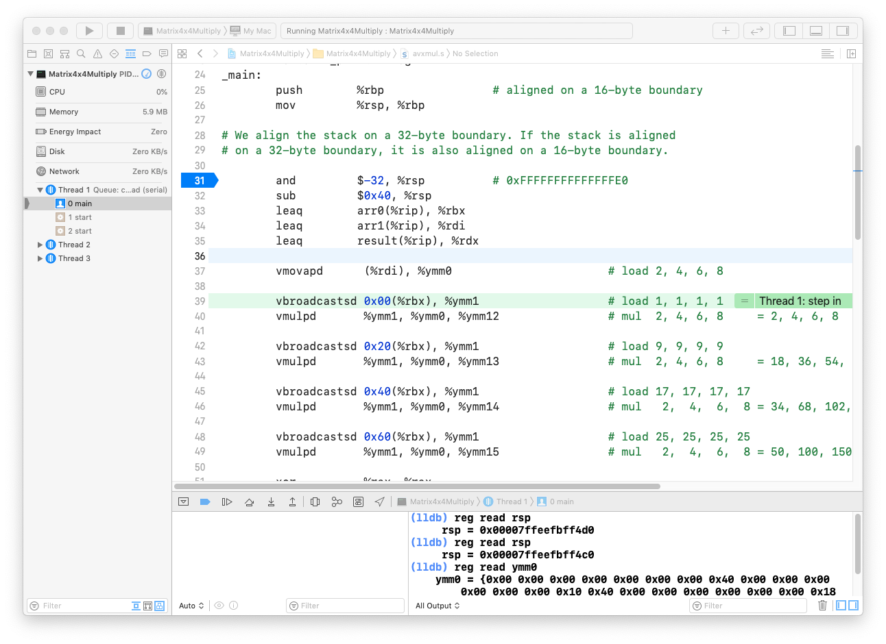
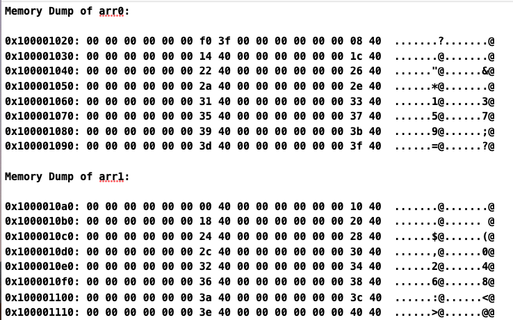
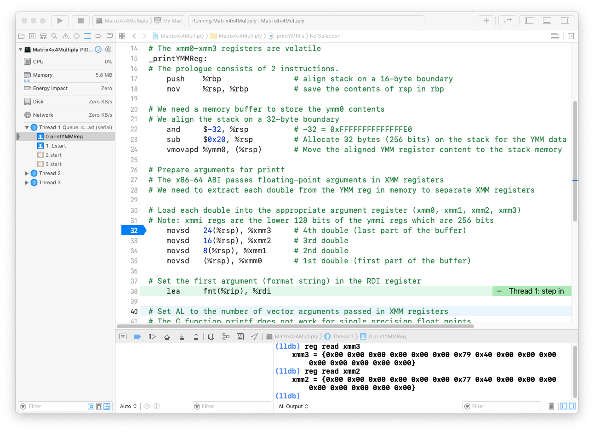

### Matrix multiplication with 256-bit SIMD instructions.

### Overview

AVX instructions were introduced in 2011 with the release of the Sandy Bridge CPU from Intel. Four quad words of data (4 x 8 x 8 bits) can be loaded or stored or operated on by just a single VEX-prefix encoded AVX instruction. There are AVX instructions which operate on eight double words of data (8 x 4 x 8). 

A single precision floating point is 4 bytes (a double word) and a double precision floating point is 8 bytes (a quad word). For example, **vmovaps** and **vmovapd** can move single and double precision floating points.

A long integer is 8 bytes (64 bits) and an integer is 4 bytes (32 bits). The instructions **vmovdqa** and **vmovdqu** aligned packed integers and unaligned packed integers respectively. These 2 instructions can be used load/store 256 bits of data from and to memory.

### Details

I came across an article which presented a method of implementing a 4x4 matrix multiplication using SIMD instructions. The reader can visit the site listed under the section *Weblink* for more details.

The assembly source code was originally written and assembled with GAS (gnu as) for the Windows OS. The default assembler on macOS is a version of GAS. Out-of-the-Box,  XCode has good support for debugging  GAS assembly programs written in AT&T and Intel synax.

The reader can assemble and debug this program step-by-step from within XCode.  Just click on the gutter next to a line of assembly source code to create a breakpoint.

In the debug area, the **(lldb)** prompt will appear when the program program pauses at the breakpoint. The user can click on the controls in the Debugging Toolbar to **step into**, **step over** or **continue program execution** etc.

The reader could check if the comments made by the author are correct by stepping into each instruction. Given below is a memory dump of **arr0** and **arr1**. 

The size of each double floating point is 8 bytes and the values are stored in Little-Endian order. So, 1.0 is presented as **00 00 00 00 00 00 f0 3f** and 32.0 as **00 00 00 00 00 00 40 40**. The binary representation of 1.0 is **0011 1111 1111 0000 ... 0000** and -1.0 is **1011 1111 1111 0000 ... 0000*** (in Big Endian format). In Little Endian format,  bit 63 is the sign bit. The  bits 62-52 (11 bits) represents the exponent and the rest of the bits (bits 51-0) represents the mantissa. Web link 2 will be helpful during the step-by-step debugging process.

The diagram below shows a sequence of pauses while bugging the **printYMMReg** routine:

 
 

**Notes**

a) The registers ymm0-ymm15 are caller-saved registers. Before calling another function (*callee function*), it is good programming practice for the *calling* function to save the contents of these registers on the stack. 

We are assuming that the *callee* functions called by **main** do not change the contents of the ymm12-ymm15 registers. If needs be, **main** should first save the  contents of these 4 registers and restore their values when required.

b) AVX instructions like **vmovapd** , **vmulpd**  etc. require memory to be aligned at 32-byte boundaries.

The prologue of a function:

        push    %rbp                
        mov     %rsp, %rbp

will align binary code on a 16-byte boundary. In order to align stack memory at 32-byte boundaries, one can use the instruction:

        and     $-32, %rsp          # 0xFFFFFFFFFFFFFFE0

The epilogue of a function:

        mov     %rbp, %rsp              
        pop     %rbp

will restore the rsp which was saved in the rbp register and pop the old rbp register off the stack.

**Requirements**

XCode 11.3 or later
CPU with AVX prefix support

**Weblinks**

https://mindfruit.co.uk/posts/2012/02/avx-matrix-mult-maybe/

https://www.binaryconvert.com/convert_double.html
